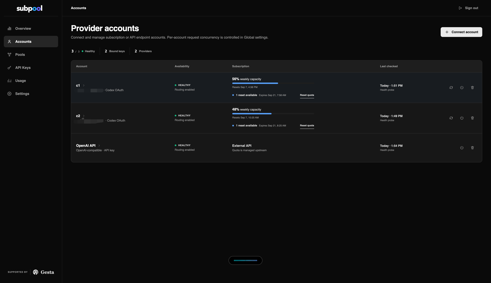
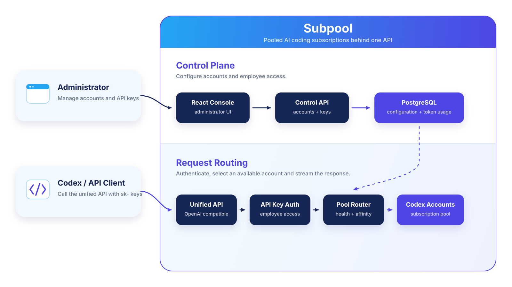

<p align="center">
  <picture>
    <source media="(prefers-color-scheme: dark)" srcset="web/public/brand/subpool-by-gesta-inverse.svg">
    
  </picture>
</p>

<p align="center">
  Enterprise AI subscription quota allocation and governance, self-hosted.
</p>

<p align="center">
  
  
  
  
</p>

Subpool is a self-hosted control plane for allocating, governing, and auditing AI subscription capacity across teams. Administrators combine authorized subscription and API accounts into pools, distribute employee-specific keys, monitor remaining quota, and expose one consistent API without storing conversation content.

<p align="center">
  
</p>

## Features

- Pool authorized subscription and API capacity behind one managed endpoint.
- Allocate employee-specific keys across healthy provider accounts.
- Monitor account health, remaining subscription capacity, and reset availability.
- Keep key-to-account assignments visible and auditable.
- Prefer subscription capacity and fall back to paid API accounts with the same employee key.
- Rate-limit, expire, and revoke employee access independently.
- Expose OpenAI-compatible Responses and Chat Completions APIs.
- Track aggregate input and output usage per API key.
- Encrypt upstream credentials and never persist prompts, responses, or source code.

## Architecture



Subpool is a single Go service with an embedded React console and PostgreSQL persistence.

## Quick start

Requires Docker Engine and Docker Compose.

```bash
cp .env.example .env

# Generate independent secrets and place them in .env.
openssl rand -base64 32
openssl rand -base64 32
openssl rand -hex 32

docker compose up -d --build
```

Replace every `replace-with-*` value, then open [http://localhost:8080](http://localhost:8080) and sign in with the administrator credentials from `.env`.

## Connect and use

1. Open **Accounts** and connect a Codex or OpenAI-compatible account.
2. Create a pool and add the account.
3. Create an employee API key for the pool.

Codex subscriptions use [device-code authorization](https://developers.openai.com/codex/auth/). Copy the one-time code from Subpool, continue to OpenAI, and confirm it there. This works on remote and headless deployments without a localhost callback or an extra exposed port. Device-code login must be enabled in ChatGPT security or workspace settings.

Configure Codex CLI:

```toml
model = "gpt-5.6-sol"
model_provider = "subpool"
model_reasoning_effort = "xhigh"

[model_providers.subpool]
name = "Subpool"
base_url = "https://subpool.example.com/v1"
wire_api = "responses"
experimental_bearer_token = "sk-example-not-a-real-key"
requires_openai_auth = false
supports_websockets = true

[features]
responses_websockets_v2 = true
```

Set `SUBPOOL_RESPONSES_WS_ENABLED=true` to accept Responses WebSocket connections. Codex subscription accounts use a dedicated upstream WebSocket; OpenAI-compatible accounts use the existing HTTP/SSE bridge. `SUBPOOL_RESPONSES_WS_FORCE_HTTP_BRIDGE=true` is an emergency rollback switch for the upstream Codex transport.

Available endpoints include `GET/POST /v1/responses`, `POST /v1/chat/completions`, `GET /v1/models`, `GET /healthz`, `GET /readyz`, and `GET /metrics`.

## Deployment notes

- Terminate TLS at a reverse proxy and set `SUBPOOL_PUBLIC_URL` to the public origin.
- Back up PostgreSQL together with `SUBPOOL_CREDENTIAL_KEY` and `SUBPOOL_API_KEY_HMAC_KEY`.
- Use PostgreSQL for shared authentication, rate-limit, assignment, and health state across replicas.

See [.env.example](.env.example) for configuration options.

## Development

```bash
docker compose up -d --build
make web-install
make dev
```

Before opening a pull request:

```bash
make web-test
make web-build
go test ./...
```

## Terms

Subpool is licensed under the [Apache License 2.0](LICENSE). It is independent and self-hosted. Use only accounts you are authorized to manage, and review each upstream provider's terms before sharing access.
