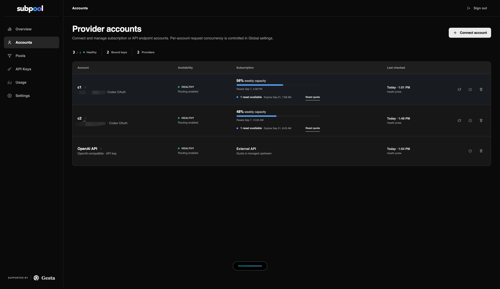
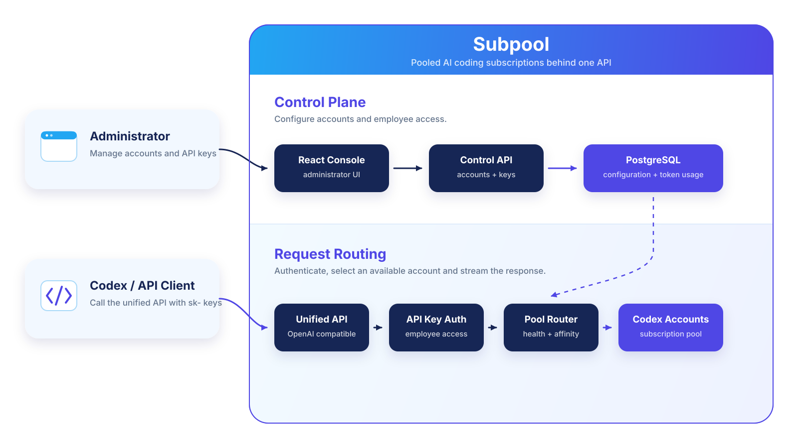

<p align="center">
  <picture>
    <source media="(prefers-color-scheme: dark)" srcset="web/public/brand/subpool-wordmark-inverse.svg">
    
  </picture>
</p>

<p align="center">
  <sub>Supported by</sub><br>
  <picture>
    <source media="(prefers-color-scheme: dark)" srcset="web/public/brand/ubang-logo-light.png">
    
  </picture>
</p>

<p align="center">
  Enterprise AI subscription quota allocation and governance, self-hosted.
</p>

<p align="center">
  
  
  
  
</p>

Subpool is a self-hosted control plane for allocating, governing, and auditing AI subscription capacity across teams. Administrators combine authorized subscription and API accounts into pools, distribute employee-specific keys, monitor remaining quota, and expose one consistent API without storing conversation content.

[Release pages](https://gesta-run.github.io/subpool/) publish the current version, immutable container image coordinates, source commit, and complete notes from GitHub Releases.

<p align="center">
  
</p>

## Features

- Pool authorized subscription and API capacity behind one managed endpoint.
- Allocate employee-specific keys across healthy provider accounts.
- Monitor account health, remaining subscription capacity, and reset availability.
- Keep key-to-account assignments visible and auditable.
- Prefer subscription capacity and fall back to paid API accounts with the same employee key.
- Rate-limit, expire, and revoke employee access independently.
- Expose OpenAI-compatible Responses and Chat Completions APIs.
- Track aggregate input and output token telemetry per API key and subscription quota in provider-native units.
- Encrypt upstream credentials and never persist prompts, responses, or source code.

## Architecture



Subpool is a single Go service with an embedded React console and PostgreSQL persistence.

## Quick start

Requires Docker Engine and Docker Compose.

```bash
cp .env.example .env

# Generate independent secrets and place them in .env.
openssl rand -base64 32
openssl rand -base64 32
openssl rand -hex 32

docker compose up -d
```

Replace every `replace-with-*` value. Docker Compose pulls the latest published Subpool image from ECR Public; no local image build is required. Open [http://localhost:8080](http://localhost:8080) and sign in with the administrator credentials from `.env`.

## Connect and use

1. Open **Accounts** and connect a Codex, GitHub Copilot, or OpenAI-compatible account.
2. Create a pool and add the account.
3. Create an employee API key for the pool.

Codex subscriptions use [device-code authorization](https://developers.openai.com/codex/auth/). Copy the one-time code from Subpool, continue to OpenAI, and confirm it there. This works on remote and headless deployments without a localhost callback or an extra exposed port. Device-code login must be enabled in ChatGPT security or workspace settings.

GitHub Copilot subscriptions use GitHub Device OAuth. Select **GitHub Copilot subscription**, generate a one-time code, open the displayed GitHub verification URL, and approve the device. Subpool verifies that the GitHub account has Copilot access before saving its encrypted credential. Copilot accounts serve `POST /v1/chat/completions`, `POST /v1/responses`, Responses WebSocket requests, and `GET /v1/models`. Subpool reads each model's `supported_endpoints` metadata and forwards Responses requests to Copilot's native `/responses` endpoint when available. Models limited to `/chat/completions` use the compatibility translator for text and image messages, function and custom tools, structured output settings, streaming events, and protocol-level token usage. Subpool reads GitHub's AI credit entitlement separately for subscription capacity and routing; token telemetry is not presented as Copilot billing. On chat-only models, stateful `previous_response_id` continuation and provider-hosted tools such as web search remain unavailable; mixed pools can fail over those requests to another compatible provider.

Fast mode is controlled per Codex subscription account from the **Accounts** page. Subpool enforces the selected mode, so employees do not need to configure Fast mode in Codex.

Codex's built-in image tool can use the same Subpool API key and bound Codex subscription. Subpool forwards JSON requests for `POST /v1/images/generations` and `POST /v1/images/edits` to the Codex subscription endpoint; no separate OpenAI API key is required. Image endpoints use the existing `responses` API key scope.

After creating an employee API key, configure Codex on each user's machine to route requests through Subpool. Edit the user-level Codex configuration file:

- Linux: `/home/<username>/.codex/config.toml` (or `~/.codex/config.toml`)
- macOS: `/Users/<username>/.codex/config.toml` (or `~/.codex/config.toml`)
- Windows: `C:\Users\<username>\.codex\config.toml` (or `%USERPROFILE%\.codex\config.toml`)

Create the `.codex` directory and `config.toml` file if necessary. Replace `https://subpool.example.com` with your Subpool URL and `sk-example-not-a-real-key` with the employee API key created in Subpool.

```toml
model = "gpt-5.6-sol"
model_provider = "subpool"
model_reasoning_effort = "xhigh"

[model_providers.subpool]
name = "Subpool"
base_url = "https://subpool.example.com/v1"
wire_api = "responses"
experimental_bearer_token = "sk-example-not-a-real-key"
requires_openai_auth = false
supports_websockets = true

[features]
responses_websockets_v2 = true
```

Save the file, then restart Codex so the new provider and WebSocket settings are loaded. Codex subscription accounts use a dedicated upstream WebSocket, while OpenAI-compatible accounts use the existing HTTP/SSE bridge.

Available endpoints include `GET/POST /v1/responses`, `POST /v1/chat/completions`, `POST /v1/images/generations`, `POST /v1/images/edits`, `GET /v1/models`, `GET /healthz`, `GET /readyz`, and `GET /metrics`.

## Deployment notes

- Terminate TLS at a reverse proxy and set `SUBPOOL_PUBLIC_URL` to the public origin.
- Back up PostgreSQL together with `SUBPOOL_CREDENTIAL_KEY` and `SUBPOOL_API_KEY_HMAC_KEY`.
- Use PostgreSQL for shared authentication, rate-limit, assignment, and health state across replicas.
- HTTP and Responses WebSocket request bodies default to 256 MiB per request, a 1 GiB estimated buffer budget across the process, and a five-minute read timeout. Tune `SUBPOOL_MAX_REQUEST_BODY_BYTES`, `SUBPOOL_MAX_INFLIGHT_REQUEST_BODY_BYTES`, and `SUBPOOL_REQUEST_BODY_READ_TIMEOUT` together for the available memory and network.
- GitHub Copilot uses the bundled public OAuth client ID by default. `SUBPOOL_COPILOT_CLIENT_ID`, `SUBPOOL_COPILOT_API_BASE`, `SUBPOOL_COPILOT_TOKEN_EXCHANGE_URL`, and `SUBPOOL_COPILOT_ENTITLEMENTS_URL` are optional upstream overrides; most deployments should leave them unchanged.

See [.env.example](.env.example) for configuration options.

## Development

```bash
make compose-dev-up
make web-install
make dev
```

`compose.dev.yaml` builds `subpool:local` from the current source tree instead of pulling the published image.

Before opening a pull request:

```bash
make web-test
make web-build
go test ./...
```

## Terms

Subpool is licensed under the [Apache License 2.0](LICENSE). It is independent and self-hosted. Use only accounts you are authorized to manage, and review each upstream provider's terms before sharing access.
